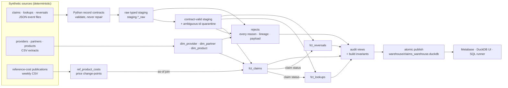
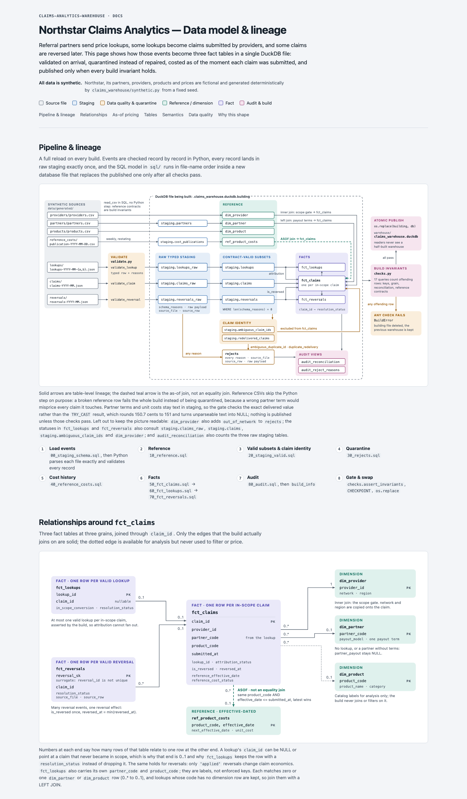
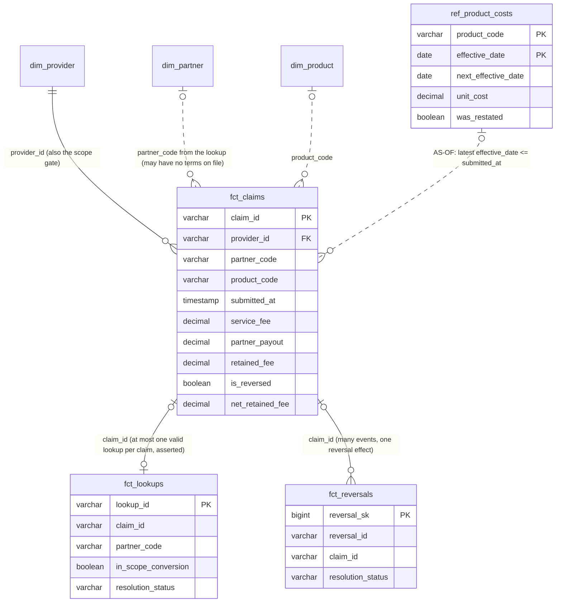
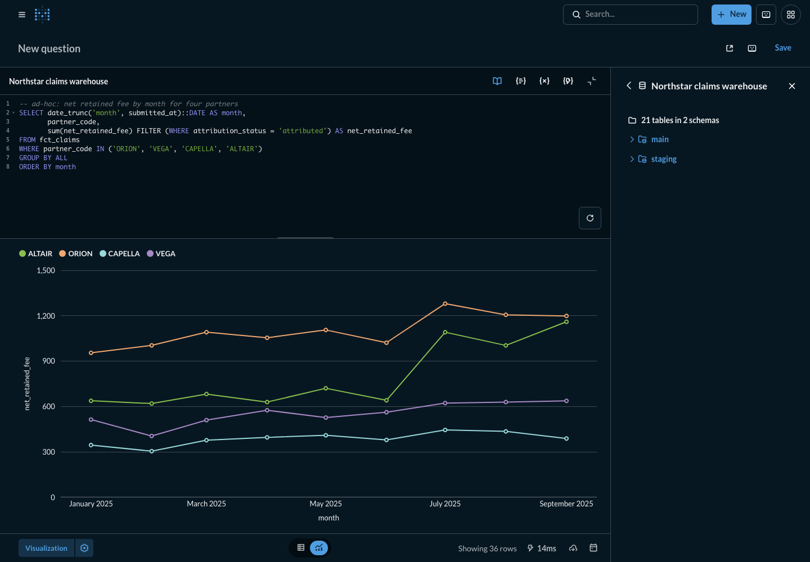
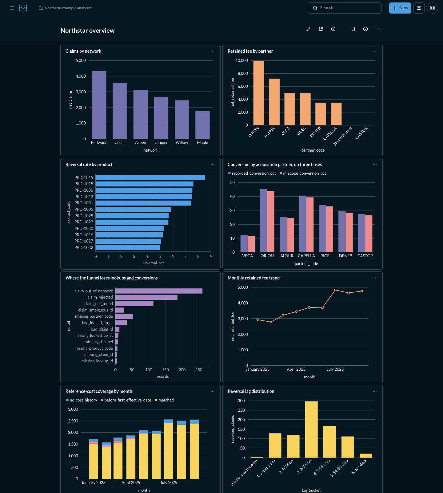

# Claims Analytics Warehouse

[](https://github.com/caioribeiro99/claims-analytics-warehouse/actions/workflows/ci.yml)

A reproducible analytics-engineering case study modeling search/lookup events, transaction
claims, reversals, commercial attribution, and effective-dated reference costs.

It is built with Python, DuckDB and plain SQL on deterministic synthetic data for a fictional
company, **Northstar**. One command generates the data and builds a queryable warehouse.
Another opens it in Metabase with example questions and a dashboard.

```bash
git clone https://github.com/caioribeiro99/claims-analytics-warehouse.git
cd claims-analytics-warehouse
make setup   # .venv with pinned dependencies (Python 3.11+)
make build   # generate + verify synthetic sources, build the warehouse (a few seconds)
make test    # the full test suite (under 10 seconds)
make demo    # Metabase on http://127.0.0.1:3000 with the warehouse connected (needs Docker)
make docs    # open the data-model page
```

> Northstar and every partner, network, provider, product, identifier and number in this
> repository are fictional and generated; any resemblance to a real organization is coincidental.

## Contents

- [Overview](#overview)
- [Architecture](#architecture)
- [Why this model](#why-this-model)
- [Data model](#data-model)
- [Grain of each fact](#grain-of-each-fact)
- [Business semantics](#business-semantics)
- [Data quality philosophy](#data-quality-philosophy)
- [Historical reference pricing](#historical-reference-pricing)
- [Reversal-aware metrics](#reversal-aware-metrics)
- [Conversion semantics](#conversion-semantics)
- [Running locally](#running-locally)
- [Running the tests](#running-the-tests)
- [Exploring with Metabase](#exploring-with-metabase)
- [Example analyses](#example-analyses)
- [Design decisions](#design-decisions)
- [Trade-offs](#trade-offs)
- [What changes at 100x scale](#what-changes-at-100x-scale)
- [Repository structure](#repository-structure)
- [Technologies](#technologies)
- [License](#license)

## Overview

Northstar runs a savings network. Referral **partners** send price **lookups**. Some lookups
convert into **claims** submitted by **providers**, and some claims are **reversed** days or
weeks later. Partners are paid per claim, either a flat amount or a share of Northstar's service
fee. Product costs are benchmarked against a weekly-published, **effective-dated reference price
list**.

The data arrives the way real feeds do: JSON event files split across many deliveries, CSV
reference extracts, and weekly price publications that restate and sometimes correct earlier
ones. It is also messy the way real feeds are, on purpose:

- malformed values (word-numbers, booleans, sub-cent amounts, impossible dates)
- missing keys, conflicting claim ids and exact re-deliveries of the same claim
- out-of-network providers
- lookups and reversals pointing at claims that do not exist
- reused reversal ids and a partner with no terms on file
- linked events out of time order, such as a reversal dated before its claim
- known-zero fees
- products with no cost history, and prices announced before they take effect

The project shows how to turn that into a warehouse you can trust and query:

- **Grain discipline:** three facts at three grains instead of one wide table.
- **Validation without repair:** bad records are quarantined whole, with every reason, their
  lineage and their original payload.
- **Explicit semantics:** NULL means unknown and 0 means a known zero; reversal-aware `net_*`
  measures; three conversion bases with different meanings.
- **Historical correctness:** an as-of join to effective-dated reference prices, with no
  fan-out and no future leakage.
- **Verification:**
  - the build refuses to publish a warehouse whose invariants fail
  - the tests compare the warehouse with an independent account written by the data generator
  - CI rebuilds everything from scratch
- **Usability:** Metabase, a DuckDB UI and a read-only SQL runner over the same file, plus a
  standalone [data-model page](docs/data-model.html).

## Architecture



The diagram is simplified; the [data-model page](docs/data-model.html) draws every dependency.
A build is a full reload:

1. Python reads every event file, applies the record contracts and loads **typed raw staging**.
2. The SQL model in [`sql/`](sql) runs in file order.
3. [`checks.py`](claims_warehouse/checks.py) asserts the build invariants: keys, grain, fan-out,
   reconciliation and reference-data contracts.
4. The new database file is atomically renamed over the old one, **only if every check passed**.

A failed build never destroys a good warehouse, and a reader (Metabase included) never sees a
half-built one.



## Why this model

**Funnel events and transaction economics live at different grains.** About 73% of lookups never
convert. Claims carry the money. Reversals are events that can repeat, arrive late, reuse ids or
point at nothing. Any single wide table goes wrong in one of three ways:

- **At claim grain,** it drops every non-converting lookup, and funnel questions become
  impossible.
- **At lookup or event grain,** it repeats claim dollars per lookup or per reversal, and every
  sum double counts unless each query remembers to deduplicate.
- **With conditional nulls everywhere,** "unknown" and "not applicable" become
  indistinguishable.

So each fact keeps its own grain and primary key. The facts relate through `claim_id`. They are
enriched only where the relationship is guaranteed not to fan out, and the build checks that
guarantee. A reference that cannot be honored becomes an explicit `resolution_status`: rows are
never silently dropped.

## Data model



The [data-model page](docs/data-model.html) is a standalone, offline HTML document. It covers
lineage, relationships, the as-of pricing rule, every table's grain, key and column groups, and
the semantics below. Open it with `make docs`.

## Grain of each fact

| Table | One row per | Primary key | Notes |
|---|---|---|---|
| `fct_claims` | in-scope claim: contract-valid, in-network provider, unambiguous id (the first delivery, if re-delivered) | `claim_id` | attribution, reversal, payout, reference cost, `net_*` |
| `fct_lookups` | contract-valid lookup | `lookup_id` | three conversion flags, `resolution_status`, `minutes_to_claim` |
| `fct_reversals` | contract-valid reversal event | `reversal_sk` (surrogate) | source `reversal_id` is not unique; lineage kept |
| `dim_provider` | in-network provider | `provider_id` | network, region; defines claim scope |
| `dim_partner` | partner | `partner_code` | exactly one payout term: flat cents or revenue share |
| `dim_product` | catalog product | `product_code` | category, unit of measure |
| `ref_product_costs` | price change-point | `(product_code, effective_date)` | `next_effective_date`, restatement flags |
| `rejects` | excluded source record | `reject_sk` | `reasons[]`, `source_file`, `source_row`, `raw` |
| `staging.*_raw` | source record, exactly once | `(source_file, source_row)` | typed values, `schema_reasons[]`, payload |
| `staging.ambiguous_claim_ids` | quarantined claim id | `claim_id` | copies that disagree |
| `staging.redelivered_claims` | later identical copy of a claim | `record_seq` | rejected as `duplicate_redelivery` |
| `staging.partners` | partner row as delivered | `partner_code` | payout terms kept as text until their shape is checked |
| `staging.cost_publications` | published price row | `(product_code, effective_date, published_date)` | `unit_cost` kept as text until its shape is checked |
| `audit_reconciliation` | event stream (view) | `stream` | `source = curated + rejected` |
| `build_info` | build | none | build time, seed, DuckDB version |

## Business semantics

| Measure | Meaning |
|---|---|
| `gross_amount` | value of the transaction paid to the provider. It is **not** Northstar revenue. |
| `service_fee` | Northstar's fee on the claim. A value of `0` is a real, known-zero fee. |
| `partner_payout` | `flat_payout_cents / 100`, or `service_fee × revenue_share_pct / 100`. `NULL` when unknown. |
| `retained_fee` | `service_fee − partner_payout`, the closest observable **margin proxy**. It is not accounting margin, and it can be negative when a flat payout exceeds a small fee. |
| `reference_cost` | `units × reference_unit_cost` in effect at submission. `NULL` when no price applies. |

`attribution_status` makes the unknowns explicit:

| Status | Meaning | `partner_payout` |
|---|---|---|
| `attributed` | a valid lookup produced the claim, and the partner has terms on file | known, including `0` for a flat-zero partner |
| `attributed_unknown_terms` | the partner sent traffic but has no terms in `dim_partner` | `NULL` |
| `unattributed` | no valid lookup references the claim | `NULL` |

Money is stored as exact `DECIMAL`, so sums reconcile to the cent without floating-point drift.

## Data quality philosophy

**Validate, never repair.** A record that breaks its contract
([`validate.py`](claims_warehouse/validate.py)) is excluded **whole**. It carries **every**
reason it triggered, its lineage (`source_file`, `source_row`) and its original JSON payload
(compacted, but with numbers exactly as delivered and repeated keys kept). Nothing is imputed,
rounded or salvaged: `"ten"` is not 10, `19.999` is not `19.99`, and `03/14/2025 10:22` is not a
timestamp. JSON numbers are parsed as exact decimals, so `19.999999999999999` is rejected instead
of quietly becoming the float `20.0`.

| Reason | Meaning |
|---|---|
| `missing_<field>` | absent, null or empty string |
| `bad_<field>` | present but unusable: wrong JSON type (numeric strings and booleans included), non-finite, more precision or magnitude than the column allows, unparseable timestamp, invalid Unicode, or the key sent twice in one record |
| `nonpositive_<field>` / `negative_<field>` | well-typed but impossible for the business |
| `not_an_object` | the array element is not a JSON object |
| `out_of_network` | the claim's provider is not in `dim_provider` |
| `ambiguous_duplicate_id` | the claim id is carried by contract-valid copies that disagree |
| `duplicate_redelivery` | an identical, later copy of a claim that was already delivered |

A lookup's `claim_id` is the one nullable field: it must be present, and `null` means the lookup
did not convert.

- **Claim identity is decided, not guessed.** Copies of a `claim_id` that are identical after
  typing are one claim delivered twice: the first delivery is kept and later copies are rejected
  as `duplicate_redelivery`. Copies that disagree on any field are different claims under one id.
  Keeping one would delete a real claim and inventing a composite key would invent a business
  rule, so the whole group is quarantined as `ambiguous_duplicate_id`. Either way `claim_id`
  stays a true primary key. A *broken* copy of a valid claim is simply rejected for its own
  defect.
- **Reconciliation is an invariant, not a report.** For every stream,
  `source records = curated records + rejected records`, asserted by the build and exposed as
  `audit_reconciliation`. Reason counts overlap, so they intentionally do not add up.
- **Reference data fails loudly.** A duplicate key, a partner with both or neither payout term,
  a publication listing the same change-point twice, or a number that is not exact and in range
  **fails the build**. Partner terms and unit costs are read as text and checked before they are
  cast, because a typed CSV read would silently round `150.7` cents to `151`. A wrong partner
  term would misprice every claim it touches, so quarantining it would hide the damage.
- **Observations are reported, not enforced.** Non-standard channel labels, product codes
  outside the catalog, reused reversal ids, negative retained fees and linked events out of time
  order are legal under the contracts. A reversal dated before its claim still reverses it, and a
  lookup timestamped after its claim still attributes it. All of them are counted in
  [`analyses/11_data_quality_observations.sql`](analyses/11_data_quality_observations.sql)
  for the producer to act on, and none of them changes a row.

## Historical reference pricing

Unit costs arrive as **weekly publications**, and each one restates the whole current price list.
The same `(product_code, effective_date)` therefore appears in many files, and occasionally a
later publication corrects a price that was already published.
[`40_reference_costs.sql`](sql/40_reference_costs.sql) reduces the publications to one row per
price **change-point**; for a restated change-point, the latest `published_date` wins.

A claim is costed with the price **in effect when it was submitted**:

```sql
ASOF LEFT JOIN ref_product_costs AS cost
    ON cost.product_code = c.product_code
   AND c.submitted_at >= cost.effective_date   -- latest change-point already in effect
```

The two obvious alternatives are both wrong. On the synthetic dataset
([`analyses/08_as_of_versus_naive_joins.sql`](analyses/08_as_of_versus_naive_joins.sql)), over
17,511 claims whose product has a cost history:

| Approach | Result |
|---|---|
| equality join on `product_code` | **46,554 rows**: one per change-point, so every sum is inflated |
| "newest price" per product | 17,511 rows, but **8,142 claims** get a price that took effect *after* they were submitted |
| as-of join (what `fct_claims` stores) | 17,511 rows, **0** future prices, identical to the validity-interval range join on `next_effective_date` |

Uncosted claims keep a `NULL` cost and say why in `reference_cost_status`: `matched`,
`before_first_effective_date` or `no_cost_history`. Nothing is imputed.

## Reversal-aware metrics

`fct_claims` keeps the submitted values untouched and carries reversal-aware `net_*` columns
alongside them (`is_net_claim`, `net_gross_amount`, `net_service_fee`, `net_partner_payout`,
`net_retained_fee`, ...):

- a **reversed** claim contributes a **known zero**, even if its value was unknown before
- otherwise the submitted value passes through, **`NULL` included**

Summing a `net_*` column equals summing its source column over non-reversed claims, with no
`WHERE NOT is_reversed` to forget. Several reversals of one claim reverse it once; orphan
reversals stay visible in `fct_reversals` and change nothing.

**The aggregation trap.** In a group whose non-reversed claims all have an *unknown* payout,
the reversed claims still contribute known zeros. A plain `SUM` then prints `0.00`, an unknown
dressed up as "nothing paid". Filter to the population where the measure is defined:

```sql
sum(net_retained_fee) FILTER (WHERE attribution_status = 'attributed')
```

Reversals also arrive late: 84% within 14 days, and a tail beyond 30
([`analyses/09_reversal_lag_distribution.sql`](analyses/09_reversal_lag_distribution.sql)).
Recent months are therefore provisional. Their claim counts and service fee can only fall as
reversals arrive. Retained fee usually falls too, but it rises when a claim whose flat payout
exceeded its fee is reversed.

## Conversion semantics

"Conversion rate" is three different numbers, nested so that each implies the previous one:

| Flag on `fct_lookups` | Question it answers | Synthetic dataset |
|---|---|---|
| `has_claim_reference` | Did the funnel **record** a conversion? The business funnel metric. | 26.79% |
| `claim_resolved` | Does the referenced claim **exist** in the claims source? Referential health. | 26.63% |
| `in_scope_conversion` | Is the claim an **in-scope** claim in `fct_claims`? | 25.95% |

The gaps are diagnostics, not rounding. They come from references to claims that never arrived
(`claim_not_found`), that were rejected (`claim_rejected`), that come from out-of-network
providers (`claim_out_of_network`), or whose id is ambiguous (`claim_ambiguous_id`).

**Rule:** whenever conversion is combined with dollars (retained fee per conversion,
value per lookup), use `in_scope_conversion`. It is the only basis on which every counted
conversion has economics behind it.

## Running locally

**Prerequisites:** Python 3.11+ and `make` on macOS or Linux. Docker is needed only for
`make demo`. If `python3` is older than 3.11, pass an interpreter:
`make setup PYTHON=python3.11`.

```bash
make setup      # create .venv, install duckdb, pytest, ruff (pinned)
make build      # = make data + build
make analyses   # run every example analysis in the terminal
make help       # all targets
```

`make data` writes the synthetic sources to `data/generated/` (gitignored) and checks them
byte-for-byte against [`data/synthetic-manifest.json`](data/synthetic-manifest.json). The
generator draws only from `random.Random.random()`, whose sequence Python guarantees across
versions, and uses exact integer and `Decimal` arithmetic on top. The same seed yields identical
bytes on every platform: verified on Python 3.11–3.14 locally, and on Linux in CI. After an
intentional generator change, `make manifest` re-pins it.

`make build` ends with a reconciliation and headline summary (excerpt; the per-reason lines
under each stream are omitted here):

```text
== reconciliation: source = curated + rejected ==========================
  claims      19,276 =   18,735 +   541   ok
  lookups     70,288 =   70,159 +   129   ok
  reversals      917 =      901 +    16   ok

== headline ===============================================================
  in-scope claims 18,735 | reversed 4.5%
  conversion  recorded 26.79% | resolved 26.63% | in scope 25.95%
  net service fee $49,044.71
    = partner payout $13,065.55 + retained fee $33,949.71 + fee with unknown payout $2,029.45
  reference cost  matched 17,184 | no_cost_history 1,224 | before_first_effective_date 327
```

To query from the terminal, use the read-only runner or any DuckDB client:

```bash
.venv/bin/python -m claims_warehouse.query -c "SELECT * FROM audit_reconciliation"
.venv/bin/python -m claims_warehouse.query analyses/04_partner_conversion.sql
duckdb -readonly warehouse/claims_warehouse.duckdb   # if the DuckDB CLI is installed
make ui                                             # optional DuckDB local UI, read-only attach
```

## Running the tests

```bash
make test    # pytest
make check   # lint, tests, a clean rebuild and every analysis (CI also builds the demo image)
```

The suite runs the **real pipeline**; nothing is mocked.

1. **Record contracts:** unit tests for [`validate.py`](claims_warehouse/validate.py), covering
   missing vs bad, booleans, numeric strings, precision, timestamp shapes, exact decimal
   parsing, repeated keys and invalid Unicode.
2. **Model behavior on tiny inline fixtures.** Each test writes a handful of records, runs the
   same `build()` as `make build` and queries the result. The cases include:
   - payout models (flat, flat-zero, revenue share, unknown terms)
   - reversal semantics (zeroing, double and orphan reversals, reused ids)
   - rejects and reconciliation, and nothing salvaged
   - claim identity and scope (out-of-network, conflicting ids, exact and broken re-deliveries,
     and the precedence when they overlap)
   - the build invariants that bad input can break: attribution fan-out, duplicate or missing
     keys, and reference contracts
   - reference contracts (terms or costs that would be rounded, or are out of range, fail the
     build)
   - as-of pricing (boundaries, future prices, restatements, naive join fan-out, range-join
     equivalence)
   - conversion statuses
   - delivery faults (invalid JSON or UTF-8) and atomic publish when a build fails
3. **End to end on the full synthetic dataset.** The generator writes `_expected.json`, its own
   account of every record it built and every edge case it injected. Record-level defects,
   economics and reference costs follow from how each record was constructed, not from the
   validators or the SQL. The tests compare the warehouse with it:
   - the exact reasons for every rejected record
   - every non-trivial resolution status
   - reconciliation, row counts, attribution consistency, nested conversion flags
   - NULL vs zero, no future leakage, and the injected out-of-order events
   - economics to the last decimal, including fee = payout + retained fee + unknown-payout fee

   Expected values are therefore derived, never hand-copied. Scope and status precedence are the
   one place where the generator has to restate the model's rules, so those rules are also
   pinned by the hand-written cases in layer 2.
4. **Determinism:** the generated files match the pinned manifest, regenerate byte-identically,
   and change with the seed.

## Exploring with Metabase

```bash
make demo                        # build, then start Metabase and provision it
METABASE_PORT=3300 make demo     # if port 3000 is taken
```

`make demo` builds a Metabase image and starts it with Docker Compose, **bound to 127.0.0.1
only**. It then provisions Metabase through its REST API. Provisioning is idempotent: running
`make demo` again rebuilds the warehouse and restarts Metabase on the new file, but creates no
duplicate account, connection, question or dashboard:

- **Admin account:** a local-only account with a randomly generated password, stored in
  `.demo/metabase-admin.json` (gitignored) and printed at the end.
- **Warehouse connection:** mounted read-only and opened with `read_only=true`, so writes are
  blocked twice.
- **Example questions:** a collection with one saved question per file in
  [`analyses/`](analyses), each with the chart type declared in the file header.
- **Dashboard:** a *Northstar overview* dashboard built from those questions.

To explore:

- **Ad-hoc SQL:** **New → SQL query**, pick *Northstar claims warehouse*, write DuckDB SQL,
  run it, then **Visualization** to chart the result.

  

- **Example questions:** open them from the collection and edit freely.
- **After `make build`:** run `make demo` again. It restarts Metabase so it reads the newly
  published file.
- **Stop or remove:** `make demo-down` stops the container and keeps its state;
  `make demo-reset` removes the container, its application database and the generated
  credentials.

The image pins Metabase OSS, the MotherDuck DuckDB driver and DuckDB's `icu` extension. It
verifies every download against a sha256 checksum at build time and runs on a glibc base,
because the driver's native library cannot load on the Alpine-based official image. Nothing
binary is committed. See [`demo/README.md`](demo/README.md) for versions, licenses and
troubleshooting.



## Example analyses

Each file in [`analyses/`](analyses) holds one query with a short header. It runs in the terminal
(`make analyses`) and is loaded into Metabase as a saved question. The queries are written to
show reusable SQL patterns, not to give fixed answers.

| File | Question | Patterns |
|---|---|---|
| `00_reconciliation` | Does every source record land exactly once? | audit view |
| `01_network_volume` | How do volume and value split by network? | `GROUP BY`, `FILTER`, share of total with a window |
| `02_partner_retained_fee` | Which partners leave Northstar the most fee? | dimension join, `FILTER` to where a measure is defined, `NULLIF` |
| `03_product_reversal_rate` | Which products lose claims after the sale? | conditional aggregation, `HAVING` |
| `04_partner_conversion` | How does each partner convert, on each basis? | boolean aggregation, nested flags |
| `05_funnel_failure_reasons` | Where does the funnel lose lookups and conversions? | `UNION ALL` diagnostics, per-stage denominators from a window over grouped rows |
| `06_monthly_retained_fee_trend` | How is retained fee trending? | `DATE_TRUNC`, running total, `LAG` |
| `07_reference_cost_coverage` | How much of volume can be costed? | pivot by conditional aggregation |
| `08_as_of_versus_naive_joins` | Why an as-of join? | `ASOF JOIN`, range join, leakage checks |
| `09_reversal_lag_distribution` | How long do numbers stay provisional? | join across grains, `QUALIFY`, buckets, percentiles |
| `10_efficiency_per_lookup` | Which partners create value per lookup, not just volume? | aggregate each grain, then join |
| `11_data_quality_observations` | What is legal but worth watching? | reported, never repaired |

## Design decisions

- **DuckDB.** The workload is analytical, single-node and small: about 90,000 events. DuckDB is a columnar engine in a library, so there is no server to run.
  - one portable file that Metabase, the DuckDB UI and Python all read
  - native `ASOF` joins, `QUALIFY`, list types for reason arrays, exact `DECIMAL`
  - a full build in about two seconds

  The engine would not be the first thing to change at larger scale; the machinery around it
  would.
- **Python for record contracts, SQL for the model.** JSON type semantics (`30` vs `"30"` vs
  `true`, cent precision, strict timestamps) are easiest to state and unit-test precisely in a
  small Python module. Everything relational (scope, identity, attribution, pricing, statuses)
  is plain, reviewable SQL, run in file order.
- **Plain SQL files instead of a transformation framework.** Nine files with an obvious order
  need no dependency graph tool. At team scale the same files map one-to-one onto dbt models,
  with the invariants becoming dbt tests.
- **Explicit statuses over dropped rows.** `resolution_status`, `attribution_status` and
  `reference_cost_status` turn every unknown into a queryable category.
- **Build invariants plus atomic publish.** Structural guarantees (keys, grain, no fan-out,
  reconciliation, reference contracts) are checked before the new file replaces the old one.
  Business semantics are covered by tests.
- **A generator that knows the answer.** Synthetic data is only convincing if it contains the
  hard cases, and only useful for testing if you know exactly what is in it. The generator
  injects the edge cases deliberately and records them, so the end-to-end tests have an
  expected result that does not come from the code under test.

## Trade-offs

- **Full reload.** Simple, idempotent and fast at this volume. It would not survive large
  history or frequent deliveries (see below).
- **Reference dimensions are current snapshots.** If a provider changed network or a partner
  renegotiated terms, history would be rewritten. Effective-dated dimensions are the fix at
  scale.
- **Restated prices apply retroactively.** Costing uses the latest published value of each
  change-point, which is the best knowledge today. Reporting "as known at the time" would need
  a bitemporal model that also filters on `published_date`.
- **Ambiguous claims are excluded from economics.** This is correct until the producer fixes
  identity, but it understates volume slightly. The quarantine is visible and counted.
- **Duplicate lookup ids fail the build instead of being quarantined.** The facts depend on
  lookup identity for attribution, so a broken contract there should stop the pipeline.
- **Re-deliveries collapse on typed equality.** Two copies that differ only in number formatting
  (`30` and `30.0`) count as the same claim, while copies that differ in any typed value are
  quarantined together.
- **Cross-stream time order is observed, not enforced.** Rejecting a reversal dated before its
  claim would need an agreed clock-skew tolerance with the producers; until then it is counted.
- **Channels are an open enumeration.** Unexpected labels are kept verbatim and reported. A
  closed list would reject legitimate new channels.
- **Timestamps are naive.** The contract has no offset, and a real feed would need an explicit
  time-zone agreement.

## What changes at 100x scale

- **Storage:** partitioned Parquet on object storage (by event date and stream), instead of
  re-reading every JSON file.
- **Incremental ingestion:** a file manifest for idempotent, exactly-once loads; late-arriving
  reversals applied to already-published periods; incremental models instead of a full reload.
- **Orchestration:** Dagster or Prefect around the same steps, with reconciliation and the build
  invariants as blocking asset checks.
- **Engine:** DuckDB (or MotherDuck) still covers a surprising range on one node. Beyond that, a
  warehouse or lakehouse engine, keeping the same SQL semantics. Distributed compute only where
  a workload actually needs it.
- **Transformations:** dbt models and tests with enforced model contracts; the `analyses/`
  queries become governed semantic-layer metrics.
- **Data contracts with producers:** schemas, claim-id uniqueness and allowed channels agreed
  and enforced at the edge, not discovered downstream.
- **History:** effective-dated (SCD2) providers and partner terms; bitemporal reference costs.
- **Observability:** freshness, volume and reject-rate monitors with alerting; lineage from
  source file to dashboard.

## Repository structure

```text
claims-analytics-warehouse/
├── claims_warehouse/
│   ├── synthetic.py        deterministic source generator + independent expectations
│   ├── validate.py         record contracts: validate, never repair
│   ├── build.py            ingestion, SQL runner, atomic publish, summary
│   ├── checks.py           build invariants
│   └── query.py            read-only SQL runner (files or inline SQL)
├── sql/                    the model, run in file order
│   ├── 00_staging_schema.sql
│   ├── 10_reference.sql
│   ├── 20_staging_valid.sql
│   ├── 30_rejects.sql
│   ├── 40_reference_costs.sql
│   ├── 50_fct_claims.sql
│   ├── 60_fct_lookups.sql
│   ├── 70_fct_reversals.sql
│   └── 80_audit.sql
├── analyses/               example questions (terminal + Metabase)
├── tests/                  pytest suite
├── demo/                   Metabase (Docker Compose) and optional DuckDB UI
├── docs/                   data-model.html and screenshots
├── data/
│   └── synthetic-manifest.json   pinned hashes of the generated sources
├── .github/workflows/ci.yml
├── Makefile
├── pyproject.toml
├── requirements.txt
├── requirements-dev.txt
└── LICENSE
```

## Technologies

Python 3.11+ (standard library), DuckDB 1.5.5, SQL, pytest, ruff, Metabase OSS with the
MotherDuck DuckDB driver (Docker Compose), GitHub Actions, and Mermaid.

## License

The code and the synthetic data it generates are released under the [MIT License](LICENSE).
Metabase (AGPL-3.0), the DuckDB Metabase driver (Apache-2.0) and DuckDB extensions (MIT) are
downloaded from their official sources when the demo image is built. They are not
redistributed here.
